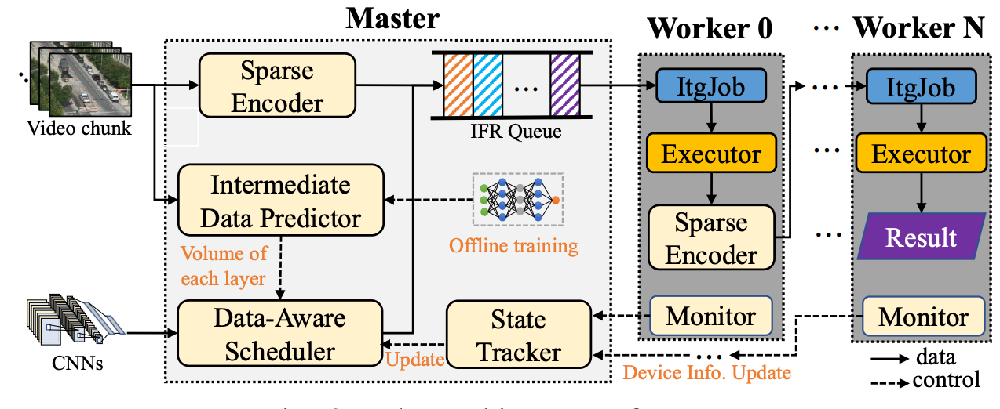

# [ResMap: Exploiting Sparse Residual Feature Map for Accelerating Cross-Edge Video Analytics](https://doi.org/10.1109/INFOCOM53939.2023.10228990)

\[[返回主页](https://github.com/withhaotian/awesome-edge-AI-papers.git)\]

## 作者信息
*Ning Chen, Shuai Zhang, Sheng Zhang, Yuting Yan, Yu Chen, Sanglu Lu (Nanjing University)*

## 研究背景
视频流分析作为终端智能的杀手级应用，主要依赖于卷积神经网络的计算与执行（Convolutional Neural Networks，CNNs）。通过引入模型分割技术（Model Partition），本文旨在解决边缘计算环境下跨设备执行CNN视频流分析任务时的冗余传输开销问题。

## 主要贡献
本文提出了一种边缘计算环境下支持实时处理的视频流分析框架——ResMap。该框架集成了三大技术模块，包括：1）特征图稀疏压缩。预先设定特征图矩阵压缩阈值，当超过该阈值时，将执行特征图压缩算法，减小数据传输量；2）中间数据预测。CNN网络层的数据量大小呈现某种映射关系，从而可以通过预测中间数据大小灵活调整方案；3）在线数据感知调度。基于视频块实时更新模型分割策略，并调度CNN任务。

