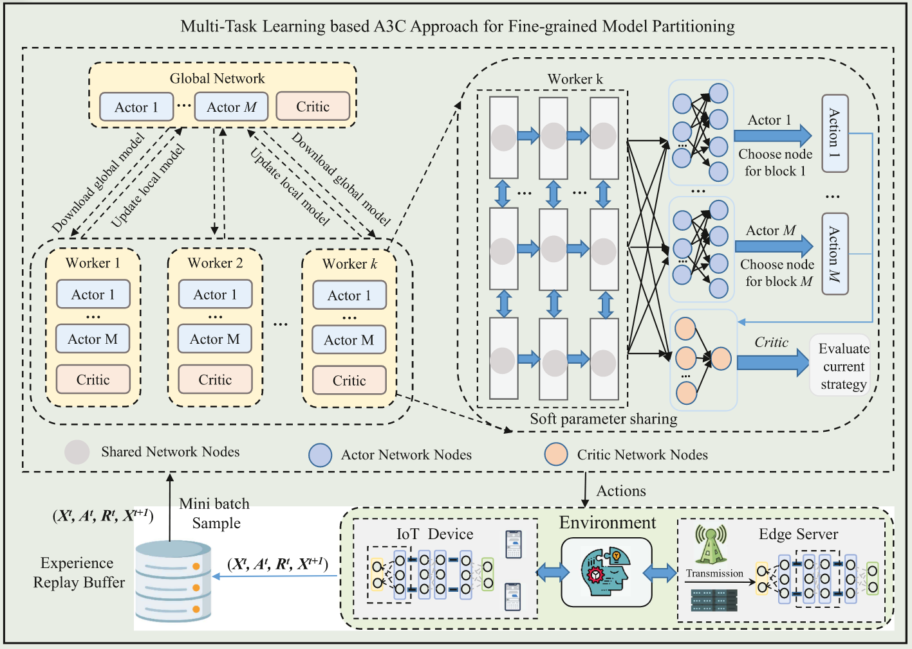

# [Distributed DNN Inference with Fine-Grained Model Partitioning in Mobile Edge Computing Networks](https://ieeexplore.ieee.org/document/10413648)

\[[返回主页](../../README.md#2024)\]

## 作者信息
*Hui Li, Xiuhua Li, Qilin Fan (Chongqing University), Qiang He (Huazhong University of Science and Technology), Xiaofei Wang (Tian Jin University), Victor C. M. Leung (The University of British Columbia)*

## 研究背景
移动边缘计算场景下，边缘与终端设备资源受限，且许多DNN模型具有深度和复杂的结构，使得细粒度模型分割方法在搜索可行划分策略时面临巨大搜索空间，导致较大的推理时延。

## 主要贡献
1）	针对边缘与终端设备资源受限问题，提出一种细粒度的模型分割方法，其将DNN模型结构视为顺序的推理任务图，并将每一个作为图节点的DNN块作为分割单元。
2）	针对复杂模型分割时分割策略搜索空间过大导致的时延问题，提出一种基于A3C的多任务学习方法，其通过软参数共享的方式将行动家和评论家网络的参数进行聚合，加速训练的收敛速度，并将最终输出层扩展成多个分支来为每个DNN块确定划分策略。

